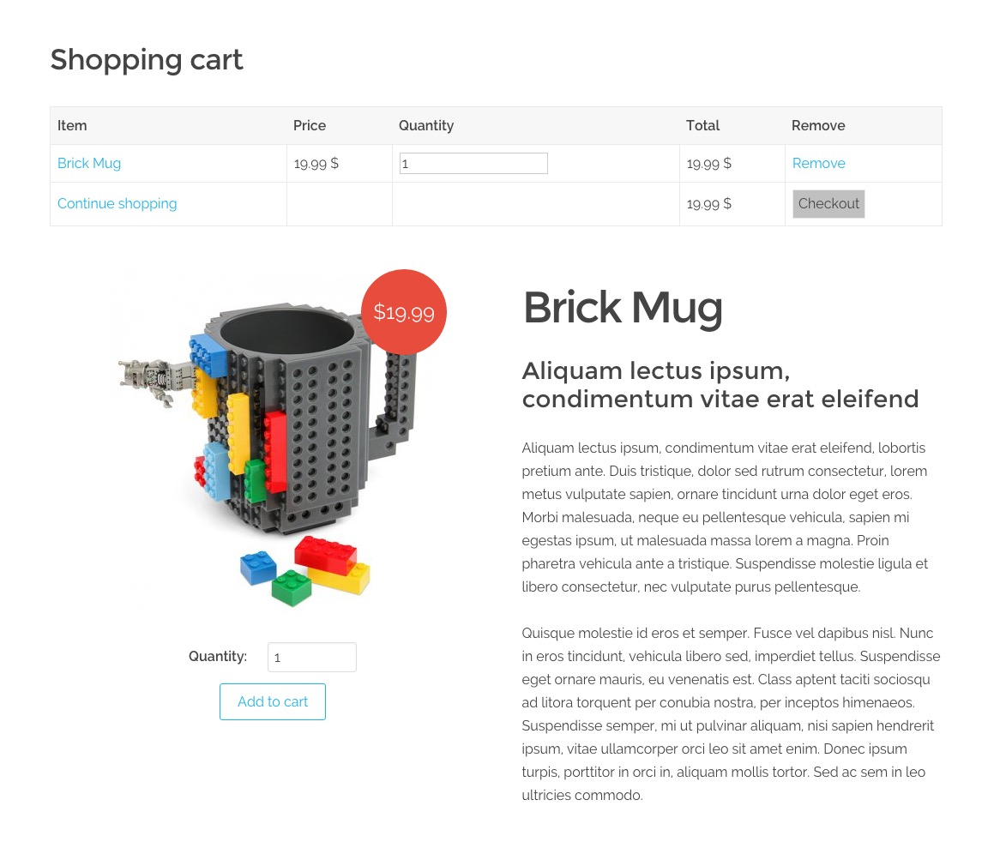

# Grav Shopping Cart Plugin

### Screenshot of Products Listing


### Screenshot of Single Product



`Shopping Cart` is a [Grav](http://github.com/getgrav/grav) plugin that adds e-commerce support to Grav. Currenty Stripe and PayPal are the only payment methods supported.

# Installation

To install this plugin, just download the zip version of this repository and unzip it under `/your/site/grav/user/plugins`. Then, rename the folder to `shoppingcart`.

You should now have all the plugin files under

	/your/site/grav/user/plugins/shoppingcart

# Usage

Create a page of type `shoppingcart.md`.
This page will contain a list of categories, provided by its subpages.
The categories are pages of type `shoppingcart_category.md`.

In turn, those pages have subpages of type `shoppingcart_detail.md`, which are the product pages.

Here's an example of a possible page structure:

```
01.shop
	shoppingcart.md
	01.t-shirts
		shoppingcart_category.md
		01.first-t-shirt
			product_image.jpg
			shoppingcart_detail.md
		02.second-t-shirt
			product_image.jpg
			shoppingcart_detail.md
	02.mugs
		shoppingcart_category.md
		01.first-mug
			product_image.jpg
			shoppingcart_detail.md
		02.second-mug
			product_image.jpg
			shoppingcart_detail.md
```

You can use the [Shop Site Skeleton](https://github.com/getgrav/grav-skeleton-shop-site) to jump start with the pages structure, and change the markdown page names.

### Categories List Page

The main "Shop" page, with the list of the available categories, will use this structure:

```
---
title: Shop
body_classes: fullwidth
content:
    items: @self.children
    order:
        by: title
        dir: asc
---

# Shop
```

### Single Category Page

The category page will follow this structure:

```
---
title: Geek Toys
category: Geek Toys
content:
    items: @self.children
    order:
        by: title
        dir: asc
---

# Geek Toys
## Anime, Gaming, Movies, Comics, we have **all your toys**
```

### Single Product Page

Product Pages using `shoppingcart_detail.md` will follow this structure:

```
---
title: Product title
price: 19.99
---

#### Product title to be shown in the page

Product description
```

# Adding a Checkout Plugin

Currently there are two Checkout plugins: Stripe and PayPal. Get one of the two, or both, install them and configure their options through the Admin Panel.

# Visualizing orders

Orders are saved in the `user/data/shoppingcart` folder as yaml files. You can view them in the Admin using the Shopping Cart menu.
